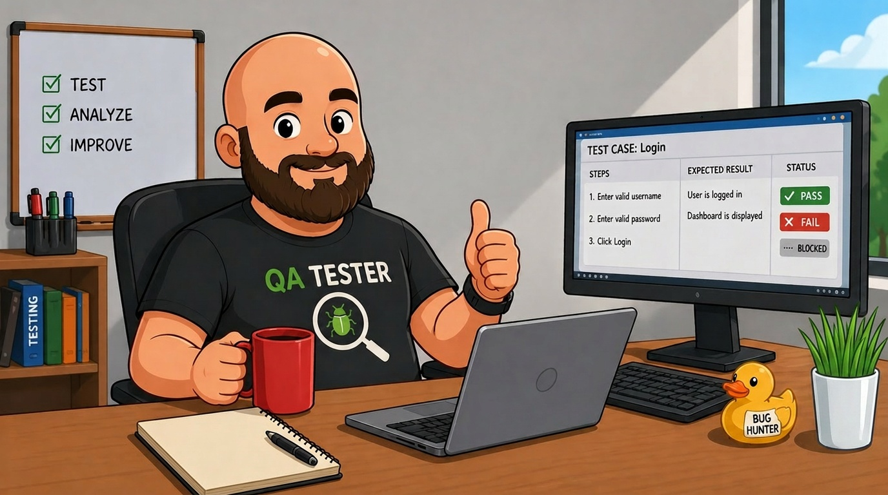

# 👨‍💻 QA Engineer Portfolio

Привет! Меня зовут Петр. Я начинающий тестировщик ПО.

# Навыки:

---

## 🛠️ Тестирование
  * Функциональное тестирование
  * Регрессионное тестирование
  * Smoke / Sanity тесты
  
## 📁 Документация
  * Тест-кейсы
  * Чек-листы
  * Баг-репорты
  
## 🔌 API
  * Postman
  * Работа с GET / POST запросами

## 📖 Основы
  * HTTP / HTTPS
  * Клиент-серверная архитектура
  * SQL (JOIN, SELECT)

## 🧰 Инструменты и технологии:

---

## 🎓 Обучение

---

[Тестирование ПО с нуля. Теория + практика](https://github.com/littlesitewp/stepik-course.git)

## 📬 Контакты

---

